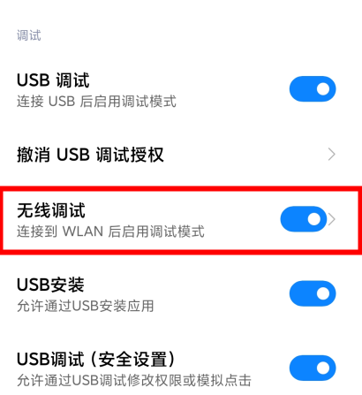
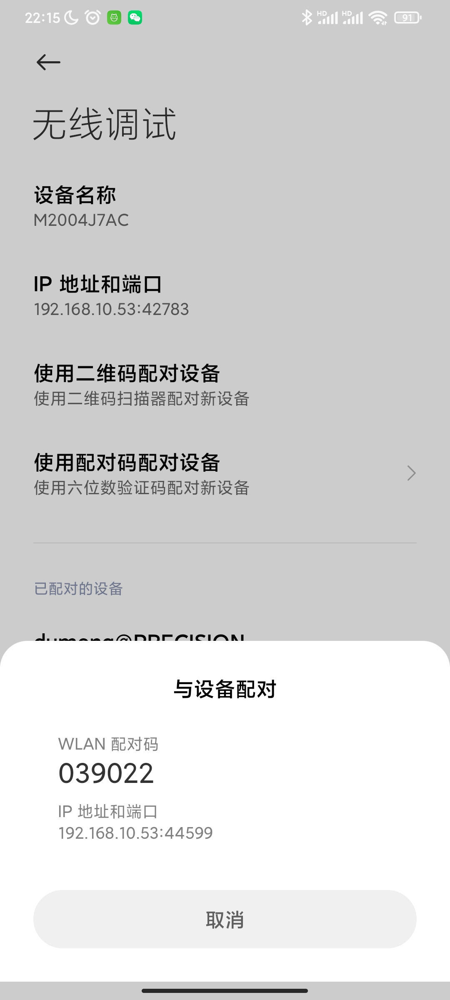
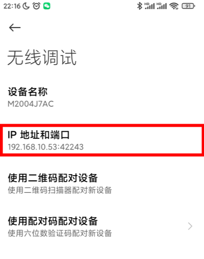

由于自己的小米手机使用数据线一直无法被电脑检测到，所以决定使用 wifi 进行连接，从而进行无线调试。

1，启用 wifi 调试。

在开发者模式下启用 无线调试 选项。



2，进行无线配对。

确保手机和电脑属于同一网络。进入 无线调试 选项，选择使用配对码配对设备



在控制台中，输入

```bash
adb pair <host>:<port>
```

之后会提示输入配对码，输入即可。

3，在无线配对成功后，在 windows/linux 下，还需要手动进行连接。

```bash
adb connect <host>:<port>
```

注意此处的 host 和 port 为在无线调试页面直接显示的主机地址和端口，和配对时的端口是不同的。



4，现在查看设备列表：

```bash
adb devices
```

可以看到设备出现在了设备列表中。
