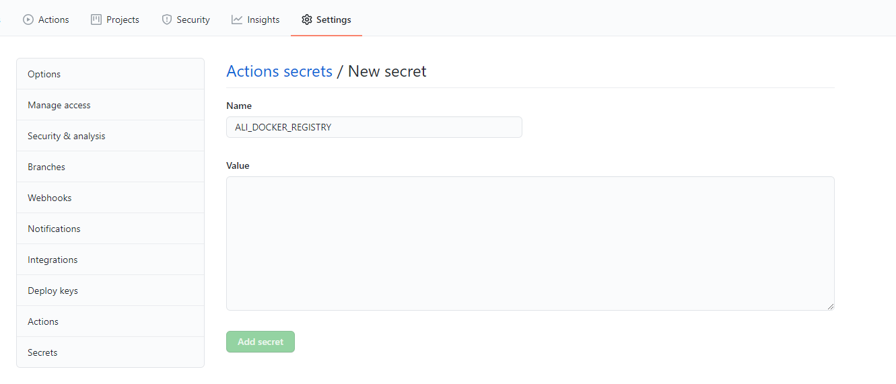

以部署一个 Aqueduct 应用为例。

## 创建 Dockerfile

根据[aqueduct 文档](https://aqueduct.io/docs/deploy/deploy_docker/)创建`Dockerfile`

```dockerfile
FROM google/dart

WORKDIR /app
ADD pubspec.* /app/
RUN pub get --no-precompile
ADD . /app/
RUN pub get --offline --no-precompile

WORKDIR /app
EXPOSE 8888
# ENTRYPOINT ["pub", "run", "aqueduct:aqueduct", "serve", "--port", "80"]
ENTRYPOINT ["dart", "run", "bin/main.dart"]
```

## 创建 registry

可以使用阿里云的私有[docker registry](https://cr.console.aliyun.com/)。
在控制台中，可以创建一个命名空间.

## 远程主机准备

将远程主机上的用户添加到 docker 组

```bash
sudo groupadd docker
sudo usermod -aG docker [non-root user]
newgrp docker
```

创建一对 ssh key, 将 publickey 添加到 remote 的 authorized_keys 中.

```bash
ssh-keygen -t rsa -C "github action key"
```

## 创建所需要的 secret

在 github 仓库中创建 secret


需要的 secret 有：

- HOST ： 远程主机地址
- USERNAME : 远程主机的用户名
- KEY： 远程主机上的 ssh 密钥
- REGISTRY：docker registry 的地址,包括命名空间，例如： registry-intl.ap-southeast-1.aliyuncs.com/ns
- REGISTRY_USERNAME：registry 的用户名
- REGISTRY_PASSWORD： registry 的密码

## 创建 action 文件

在代码仓库中，创建 `.github/workflows/deploy.yml`.

```yml
name: deploy

on:
  push:
    branches: [master, release]

jobs:
  deploy:
    name: build and deploy
    runs-on: ubuntu-latest
    env:
      REPO_NAME: <your repo name>
      IMAGE_NAME: ${{ secrets.REGISTRY }}/<your repo name>:${{ github.sha }}
    steps:
      - uses: actions/checkout@v2
      - name: Set environment for branch
        run: |
          if [[ $GITHUB_REF == 'refs/heads/master' ]]; then
              echo "STAGE=test" >> "$GITHUB_ENV"
              echo "PORT=5102" >> "$GITHUB_ENV"
          else if [[ $GITHUB_REF == 'refs/heads/release' ]]; then
              echo "STAGE=prod" >> "$GITHUB_ENV"
              echo "PORT=5103" >> "$GITHUB_ENV"
          fi
      - name: docker login
        run: docker login -u ${{ secrets.REGISTRY_USERNAME}}  -p ${{ secrets.REGISTRY_PASSWORD}} ${{ secrets.REGISTRY}}
      - name: docker build
        run: docker build -t $IMAGE_NAME -f ./Dockerfile . && docker push $IMAGE_NAME
      - name: run image
        uses: appleboy/ssh-action@master
        with:
          host: ${{ secrets.HOST }}
          username: ${{ secrets.USERNAME }}
          key: ${{ secrets.KEY }}
          script: >-
            docker login -u ${{ secrets.REGISTRY_USERNAME }}   -p ${{ secrets.REGISTRY_PASSWORD}} ${{ secrets.REGISTRY}} &&
            docker pull ${{ env.IMAGE_NAME }} && 
            docker rm ${{ env.IMAGE_NAME }}-${{ env.STAGE }}
            docker run -d -p 8888:${{ env.PORT }} ${{ env.IMAGE_NAME }}-${{ env.STAGE }}
```
